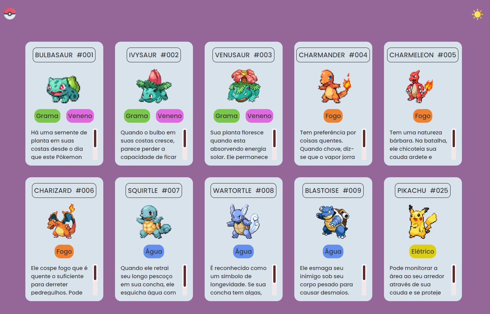

##  Lista de Pókemon 
A lista funcionando:  
<a target="_blank"> https://beatrindade.github.io/Lista_Pokemon/ <a> 
 
Neste projeto aprendi: 
- Alterar a cor tema para "noturno", quando aperta o botão;  
- Estilizar a barra do scroll na lateral e dentro do card.  
Projeto do 0 ao Programador do Canal do Youtube: [Dev em Dobro](https://www.youtube.com/@DevemDobro)

<h2>  Modo CLaro </h2>

<h2>  Modo Escuro </h2>

