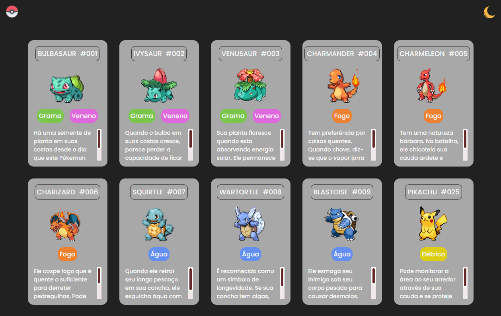

 

##  Lista de Pókemon 
 

Neste projeto aprendi a alterar a cor tema para "noturno" e estilizar o scroll. 
Projeto do 0 ao Programador do Canal do Youtube: [Dev em Dobro](https://www.youtube.com/@DevemDobro)

 
<h2>  Modo CLaro </h2>

 
<h2>  Modo Escuro </h2>
